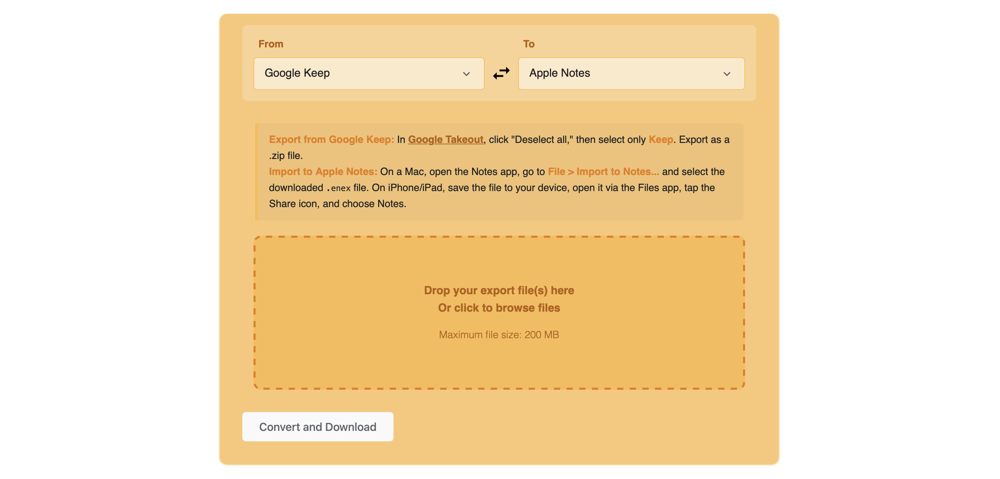

 # Keep to Notes

A simple, secure, browser-based tool to convert your Google Keep notes (exported via Google Takeout) into the `.enex` format, ready for import into Apple Notes or Evernote.

**[Try it live!](https://keeptonotes.mgks.dev/)**

## Key Features

*   **Privacy First:** Runs **entirely in your browser**. Your notes are never uploaded to any server.
*   **Easy to Use:** Drag-and-drop your Google Takeout ZIP file or individual Keep HTML files.
*   **Apple Notes & Evernote Compatible:** Generates a standard `.enex` file recognized by both Apple Notes and Evernote.
*   **Handles:**
    *   Note titles and content (HTML).
    *   Creation/modification dates (best effort parsing).
    *   Checklists (checked and unchecked items).
    *   Google Keep labels (converted to tags).
    *   Embedded base64 images within notes.
    *   Archived note status (adds an "archived" tag).
*   **File Selection:** Choose which specific notes to include in the conversion.
*   **No Installation Required:** Works directly in modern web browsers (Chrome, Firefox, Safari, Edge).

## How to Use

### Step 1: Export Your Google Keep Notes

1.  Go to [Google Takeout](https://takeout.google.com/).
2.  Click "**Deselect all**".
3.  Scroll down and select "**Keep**".
4.  Click "**Next step**".
5.  Choose delivery method (e.g., "Send download link via email").
6.  Select **.zip** for file type. Choose a suitable archive size (2GB is usually fine unless you have massive attachments).
7.  Click "**Create export**". Google will prepare your archive (this can take minutes or hours).
8.  Download the ZIP file once it's ready.

### Step 2: Convert Your Notes Using This Tool

1.  Visit **[keeptonotes.mgks.dev](https://keeptonotes.mgks.dev/)**.
2.  Drag and drop the downloaded Google Takeout `.zip` file onto the upload area, OR click the area to browse and select the `.zip` file.
    *   Alternatively, you can upload individual `.html` files extracted from the Keep folder within the Takeout zip.
3.  The tool will process the file(s) and list the found Keep notes.
4.  By default, all notes are selected. Uncheck any notes you *don't* want to convert.
5.  Click the "**Convert to ENEX Format**" button.
6.  Your browser will process the notes and automatically download the `google_keep_notes.enex` file.

### Step 3: Import to Apple Notes

*   **On Mac:**
    1.  Open the **Notes** app.
    2.  Go to `File` > `Import to Notes...`.
    3.  Select the downloaded `.enex` file.
    4.  Choose whether to preserve folder structure (if applicable) and click `Import`.
*   **On iPhone/iPad:**
    1.  Get the `.enex` file onto your device (e.g., email it to yourself, use AirDrop, save to iCloud Drive/Files).
    2.  Open the **Files** app and locate the `.enex` file.
    3.  Tap the file.
    4.  Tap the **Share** icon.
    5.  Choose the **Notes** app from the share options.
    6.  Confirm the import.

*(The process for importing into Evernote is similar via its desktop or web clients).*

## Limitations

*   **Formatting:** While basic HTML is preserved, complex formatting might not transfer perfectly.
*   **Attachments:** Only embedded base64 images are included directly in the note content. References to separate image files (`.jpg`, `.png` etc. in the Takeout ZIP) are *not* processed or embedded due to browser security limitations and the complexity involved. Other attachment types (audio, PDFs) are not processed.
*   **Date Parsing:** Uses Day.js for flexible date parsing, but highly unusual date formats might default to the current date.
*   **Performance:** Very large Takeout files or thousands of notes might slow down your browser during processing. The tool has a nominal 200MB upload limit primarily as a browser performance guideline.

## Technology Stack

*   HTML5
*   CSS3
*   Vanilla JavaScript (ES6+)
*   [JSZip](https://stuk.github.io/jszip/) - For reading `.zip` files in the browser.
*   [Day.js](https://day.js.org/) - For robust date parsing and formatting.

## Privacy

This tool is designed with privacy as a core principle. **All processing happens locally in your web browser.** Your Google Takeout file and the individual notes within it are **never uploaded** to any external server. We have no access to your notes.

## Contributing

Contributions are welcome! If you find a bug or have an idea for improvement, please open an issue or submit a pull request on the [GitHub repository](https://github.com/mgks/keeptonotes).

## License

This project is open source and available under the [MIT License](LICENSE).

## Acknowledgements

Based on [Google Keep to Evernote Converter](https://gitlab.com/hmvs1/google-keep-to-evernote-converter) available on GitLab as Python script, which originally was inspired from [this thread](https://discussion.evernote.com/forums/topic/97201-how-to-transfer-all-the-notes-from-google-keep-to-evernote/); while further based on concepts and approaches found in various open-source Google Keep export parsers and ENEX generators.

## Support the Project

**[GitHub Sponsors](https://github.com/sponsors/mgks):** Support this project and my other work by becoming a GitHub sponsor, it means a lot :)

**[Follow Me](https://github.com/mgks) on GitHub** | **Add Project to Watchlist** | **Star the Project**

 